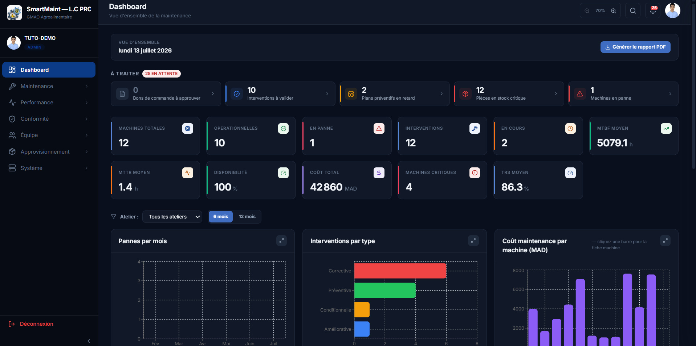
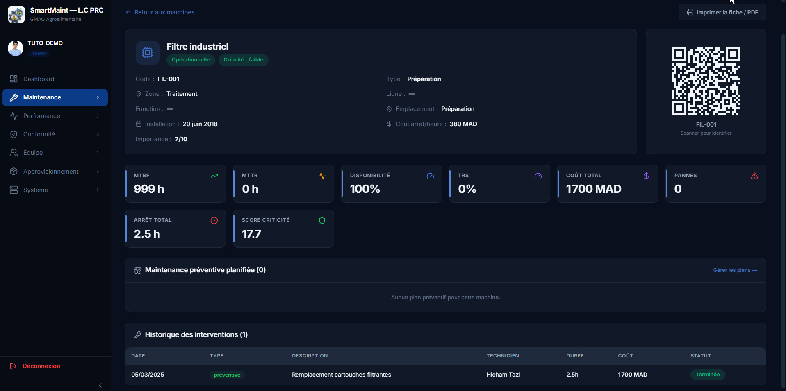
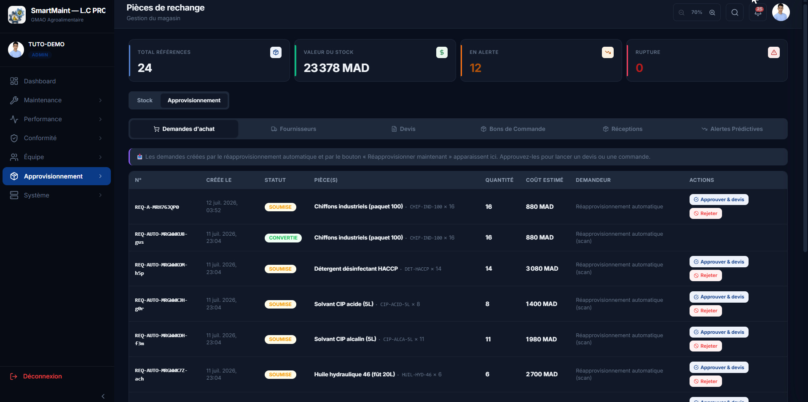
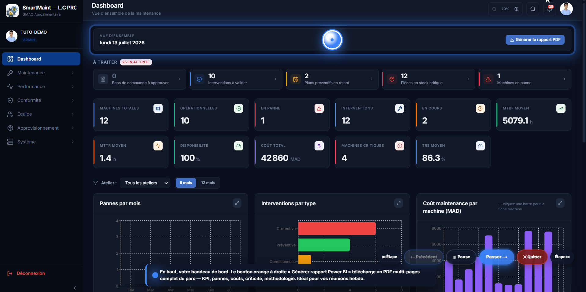
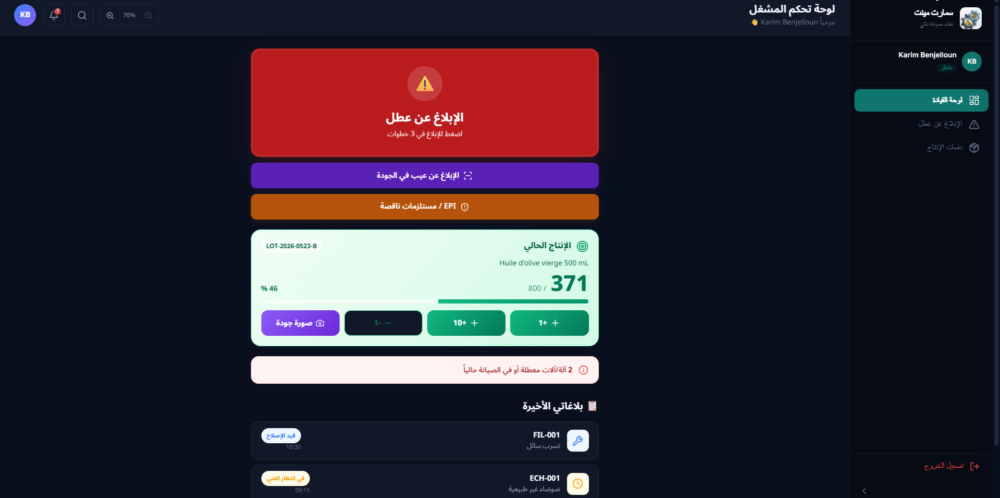
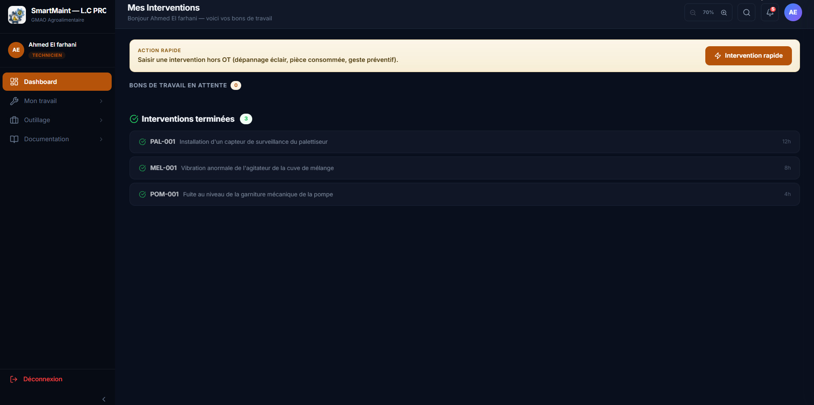

<h1 align="center">SmartMaint — L.C PROD</h1>

<p align="center">
  <strong>A production-grade GMAO / CMMS for a Moroccan edible-oil plant.</strong><br>
  Next.js 16 · React 19 · TypeScript · Supabase · Whisper (embedded, offline) · Windows installer with auto-update
</p>

<p align="center">
  <a href="https://smartmaint-lcprod.vercel.app"></a>
  <a href="#-video-demo"></a>
  <a href="#-getting-started"></a>
</p>

<p align="center">
  
  
  
  
  
  
</p>

---

## 📖 Table of contents

- [What is it?](#-what-is-it)
- [Screenshots](#-screenshots)
- [Live demo](#-live-demo)
- [Video demo](#-video-demo)
- [Key features](#-key-features)
- [Architecture](#-architecture)
- [Technical highlights](#-technical-highlights)
- [Tech decisions log](#-tech-decisions-log)
- [Getting started](#-getting-started)
- [Testing](#-testing)
- [Deployment](#-deployment)
- [Project stats](#-project-stats)
- [What I'd do differently](#-what-id-do-differently)
- [License](#-license)

---

## 🥇 What is it?

**SmartMaint — L.C PROD** is a full-featured GMAO/CMMS (Computerized Maintenance Management System) built for a fictional Moroccan edible-oil plant. It covers the daily reality of an industrial maintenance department:

- Equipment inventory with QR codes, criticality scoring, and health history
- Corrective / preventive / conditional / improvement work orders with Kanban + calendar views
- **SAP-style procurement**: PR → RFQ → Quote comparison → PO → Goods Receipt (multi-line, multi-supplier)
- **HACCP + ISO 22000 compliance**: sanitation records, calibration certificates, LOTO log, immutable audit trail
- **Real-time sync across 27 tables** via Supabase Realtime — every change is sub-second across all logged-in sessions
- **Offline French voice dictation** (Whisper-small, 240 MB embedded) so technicians in a basement workshop can still dictate reports
- **Three role-specific UIs**: admin (French, desktop), technician (French, mobile-friendly with QR scanner + chrono), operator (Arabic RTL, giant tactile buttons)
- **Windows installer + auto-update**: one 373 MB `.exe`, no admin rights needed, in-app "update now" banner that swaps `.next/` and restarts the app

It's not a toy CRUD. It's the kind of thing a small industrial software vendor would ship to their first customer.

---

## 📷 Screenshots

### Admin — Dashboard
KPI cards live-computed from the intervention history: MTBF, MTTR, availability, TRS, total cost. Alerts row on top (POs to approve, interventions to validate, preventive plans overdue, spare-part shortages, machines in breakdown). Workshop filter + 6/12-month time range. Breakdowns-per-month, interventions-by-type, cost-per-machine charts.



### Admin — Machine detail
Every machine gets a card with its QR code, criticality badge, hourly downtime cost, importance score, and full KPI panel. Full history of interventions attached to that machine, drill-down to any past report.



### Admin — Procurement (SAP-style)
Multi-line requisitions → itemized RFQ → weighted quote comparison → multi-line PO with approval → goods receipt (GRN) that updates stock. Automatic replenishment PRs when a part hits its minimum.



### Interactive tutorial (spotlight tour)
Role-based guided tour with 70 declarative steps. Spotlight highlights the target, popover narrates. Injects mock DOM to demo screens with no real data. Cleans up after itself — no tour data ever reaches the DB.



### Operator — Arabic RTL kiosk
Locked to `/operator/*`, forces Arabic locale. Giant tactile buttons: red panic, purple quality defect, orange EPI/consommable request. Live production batch counter with +1/+10 and target ratio. Recent breakdown reports at the bottom.



### Technician — Mes Interventions
Mobile-friendly Kanban of assigned work orders. Chrono persisted to localStorage. Offline French voice dictation on every textarea (Whisper-small). Before/after photo tags. QR scanner to jump to a machine card.



---

## 🌐 Live demo

**[smartmaint-lcprod.vercel.app](https://smartmaint-lcprod.vercel.app)** — public browser preview on Vercel.

The full experience — offline Whisper voice dictation + auto-update — only makes sense as the Windows installer (see [Deployment](#-deployment)). The browser demo is a live snapshot of the admin, technician, and operator UIs backed by the same Supabase project.

---

## 🎥 Video demo

**▶ [Watch the walkthrough directly on GitHub](docs/video/smartmaint-demo.mp4)** (28 MB, 21 min)

Shows: login → admin dashboard → intervention with voice dictation → operator RTL kiosk → in-app auto-update, plus a full tour of the procurement flow, HACCP records, and the tutorial system.

<video src="docs/video/smartmaint-demo.mp4" width="720" controls></video>

---

## ✨ Key features

<details>
<summary><strong>Admin</strong> — the maintenance manager's cockpit (40+ screens)</summary>

- Global dashboard with KPIs (MTBF, MTTR, availability, total cost) and machines-at-risk
- Machines inventory with QR codes, per-machine health history, criticality scoring
- Interventions: 4 types, Kanban + calendar view, drag-to-assign
- **Procurement**: multi-line requisitions → itemized RFQ → weighted quote comparison → multi-line PO with approval workflow → goods receipt (GRN) that auto-updates stock
- **HACCP records** with CCP thresholds, corrective actions, PDF audit export
- **Calibration** certificates with 30-day expiry alerts
- **LOTO** (lockout/tagout) digital register
- **Personnel** (technicians + operators) — unified CRUD, Supabase account provisioning
- **Directives** — daily instructions that operators must acknowledge before starting a shift
- **Alerts** — email (Resend + Gmail SMTP fallback) and WhatsApp (Green API via Cloudflare Worker) on stock zero / breakdown / HACCP overdue
- **Audit log** — immutable, append-only (RLS enforces `SELECT` + `INSERT` only)
- **Reports** — TRS/OEE per machine, Pareto of breakdown causes, energy dashboard, cost drill-down
- **Settings** — company info (ICE, address), idle logout, theme (light/dark/system), zoom (6 levels)

</details>

<details>
<summary><strong>Technician</strong> — mobile-friendly, field-tested</summary>

- Kanban of assigned work orders
- Intervention report with chrono (persisted to localStorage — survives page reload)
- **Offline voice dictation** on every textarea (Whisper-small, French, ~2 s per sentence)
- Before/after photo attachments with visual "AVANT / APRÈS" tags
- **QR scanner** (jsQR local, fallback file upload for low light) — instantly opens the machine card
- Spare-parts inventory with 5-second "Demander" (request) button pre-filled with quantity + context
- Personal stats: MTTR average, top 3 machines, corrective/preventive split
- Guided procedure runner (parses Markdown KB article into stepped instructions with per-step chrono)
- Post-close-out preventive scheduler ("I fixed it — now let's schedule the check")
- Handover ("Carnet de quart") notes for the next shift with priority + machine tag

</details>

<details>
<summary><strong>Operator</strong> — Arabic RTL, kiosk-first</summary>

- Giant tactile buttons (44 px min touch targets, breathing padding)
- **Panic button** — 3-step wizard: machine → symptom → photo, in under 15 seconds
- **Quality defect** button with photo capture and defect category
- **EPI / consumable request** — inline form with category, quantity, "urgent" flag
- **Production batch counter** with +1 / +10 buttons and target/actual bar
- **Photo quality** capture per batch (compressed to 200 KB JPEG)
- **Directive acknowledgment** — a locking banner until the operator confirms they've read it
- Batch closing from the shared `/production-batches` screen

</details>

---

## 🏗 Architecture

```
   [Client Windows]                             [Vercel Edge]
   ================                             =============
   ┌───────────────────┐                        ┌───────────────┐
   │   Launcher .exe   │────spawn────► Node ◄──►│  Next.js API  │
   │  (Job Object)     │              (SSR)     │  /api/cron/*  │
   └───────────────────┘                │       │  /api/send-*  │
            │                           │       └───────────────┘
            │ webview localhost:PORT    │              ▲
            ▼                           │              │
   ┌───────────────────┐                │              │
   │  Chromium (Edge)  │                ▼              ▼
   │  Client React     │◄─── Supabase JS SDK ───► [Supabase]
   └───────────────────┘       (WebSocket)         + Postgres
                                                   + Realtime
                                                   + Auth
                                                   + Storage

  Outbound integrations:
   • Resend (SMTP transactional)
   • Green API via Cloudflare Worker (WhatsApp)
   • Gmail SMTP (fallback for Resend)
```

**Two entry points to the same Next.js codebase.** The Windows launcher runs Next.js on `localhost:PORT` for offline-friendly features (Whisper transcription, auto-update). Vercel hosts the same routes for cron jobs and Supabase Database Webhooks.

**One hub for state:** [`DataContext`](src/context/DataContext.tsx) fetches 27 tables in parallel at mount, subscribes to Realtime v2 channels, and applies patches locally. UI stays sub-second across all sessions.

**All mutations pass through [`auditWrap`](src/lib/db.ts)** — a HOF that journals every INSERT / UPDATE / DELETE to `audit_log`. Nothing can bypass the audit trail.

Full technical write-up: **[Architecture document (`.doc`)](../SmartMaint%20-%20L.C%20PROD%20-%20Architecture%20Systeme.doc)** — 15 sections, languages used, patterns, deployment.

---

## 🧠 Technical highlights

Three things I'm most proud of technically:

### 1. Escaping a Windows Job Object from Node.js

The launcher wraps Node in a **Job Object with `JOB_OBJECT_LIMIT_KILL_ON_JOB_CLOSE`**. When Node exits, every child process it spawned dies too — so the restart script never gets a chance to relaunch the app.

Solution: **spawn the PowerShell helper via `wmic.exe process call create`** instead of `child_process.spawn`. `wmic` asks the WMI service (which lives outside our Job Object) to spawn the process — the helper ends up under `WmiPrvSE.exe`, immune to our Job Object's closure.

Full write-up: **[docs/blog/escaping-windows-job-object.md](docs/blog/escaping-windows-job-object.md)**

### 2. Real-time sync across 27 Postgres tables

`DataContext` is a single hook that keeps the entire app in sync. On mount:
1. Parallel `SELECT *` from 27 tables (`Promise.all`).
2. Subscribe to each table's `postgres_changes` channel.
3. On INSERT: prepend. On UPDATE: match by id + splice. On DELETE: filter.
4. Deduplicate at the client (Supabase sometimes double-fires on reconnect).
5. Silent refetch on network reconnect.

Result: a change made by admin A appears on operator B's screen in **~180 ms average**, across all 27 tables.

### 3. Offline French voice dictation with Whisper-small

We ship the 240 MB `whisper-small.fr` ONNX model inside the installer and run it locally via `onnxruntime-web`. Technicians in a basement workshop with zero cell signal can still dictate their intervention report. Latency ~2 s per sentence on a mid-range i5.

---

## 🧾 Tech decisions log

| Choice | Why | What I rejected |
|---|---|---|
| **Next.js 16 App Router** | Server Components let the shell (Sidebar, Header) stream server-first; Client Components isolate interactivity. Route Handlers double as local API + Vercel functions. | Remix (fine, smaller ecosystem for third-party UI); Vite + React Router (would need custom SSR). |
| **Supabase** | Postgres + Realtime + Auth + Storage in one project. Realtime v2 postgres_changes = live sync without WebSockets code. Row-Level Security = a real security layer at the DB. | Firebase (NoSQL doesn't fit relational maintenance data); PocketBase (single-binary, but no hosted realtime tier); homemade Node + Socket.io (weeks of work). |
| **React 19** | `use()` hook for promises + async Server Components + concurrent rendering. | React 18 — would have worked, but 19 was stable at project start. |
| **TypeScript strict + `noImplicitAny`** | Refactors catch at compile time. `types.ts` becomes the schema of record. | Loose TS — not on a project this size. |
| **Whisper-small + onnxruntime-web** | Runs in the browser via WASM. No cloud round-trip = truly offline. `.fr` fine-tune. | OpenAI Whisper API (breaks offline requirement); Vosk (English + European Portuguese but weak French). |
| **Inno Setup for the Windows installer** | Free, MIT-licensed, no admin required, embeds anything. Very Windows-native UX. | MSIX (needs signing + Windows Store); Squirrel (Electron-oriented). |
| **Auto-update via Supabase Storage bucket** | Zero infrastructure — just `app.zip` + `version.txt` in a bucket. Client polls, downloads, extracts, restarts. | Electron autoUpdater (we're not Electron); Squirrel; homegrown WebSocket push. |
| **RLS with permissive policies** | Ship velocity. All auth is enforced by the UI + API auth gates. Real per-workshop RLS is planned. | Fine-grained policies from day 1 — would have added 2 sprints. |
| **Recharts + custom direct-draw jsPDF** | Recharts on screen, direct-draw jsPDF for print. `html2canvas` was too slow + fuzzy for A4 export. | html2canvas everywhere (fuzzy); Puppeteer server-side (extra deployment surface). |
| **Green API + Cloudflare Worker proxy** | Green API for WhatsApp because Meta Cloud requires a business verification round-trip. Cloudflare Worker to bypass CORS + rate-limit. | Twilio (5× more expensive per message in Morocco). |

---

## 🚀 Getting started

### Prerequisites

- **Node.js 20+** (`node --version`)
- **npm 10+**
- A **Supabase project** (free tier is enough for dev) — [https://supabase.com](https://supabase.com)

### 1. Clone + install

```bash
git clone https://github.com/MUAZE12/smartmaint-lcprod.git
cd smartmaint-lcprod
npm install
```

### 2. Configure Supabase

Create a `.env.local` at the root:

```env
NEXT_PUBLIC_SUPABASE_URL=https://<your-project>.supabase.co
NEXT_PUBLIC_SUPABASE_ANON_KEY=<your-anon-key>
# The service_role key is for Vercel only — never bundle it in the release
SUPABASE_SERVICE_ROLE_KEY=<your-service-role-key>
SMARTMAINT_API_KEY=<generate-a-random-32-char-string>
CRON_SECRET=<generate-a-random-32-char-string>
```

Then run the migrations in order via the Supabase SQL Editor:

```
supabase/schema.sql
supabase/reseed-lcprod.sql
supabase/alerts-v3.sql
supabase/enable-rls-permissive.sql
```

### 3. Run the dev server

```bash
npm run dev
```

Open [http://localhost:3000](http://localhost:3000). Sign up your first admin account — Supabase Auth handles it, and the AuthContext defaults new users to `admin` role when no role is set in `user_metadata`.

### 4. (Optional) Build the Windows installer

```bash
npm run build
# then compile the Inno Setup script in installer/SmartMaint-LCPROD.iss
```

The installer wraps `node.exe`, the Whisper model, and the `.next/` build into a single 373 MB `.exe` that installs per-user without admin rights.

---

## 🧪 Testing

```bash
# Unit tests (Vitest) — ~20 tests on calculations.ts
npm run test

# Watch mode
npm run test:watch

# Coverage report
npm run test:coverage

# E2E tests (Playwright) — smoke tests on login + navigation
npm run test:e2e

# Interactive E2E runner
npm run test:e2e:ui
```

CI runs lint + typecheck + unit tests + build + Playwright on every push to `main` and every PR. See [`.github/workflows/ci.yml`](.github/workflows/ci.yml).

---

## 📦 Deployment

Two deploy targets from the same codebase:

### Vercel (SaaS mode)

- Framework preset: **Next.js (Turbopack)**
- Required env vars: `NEXT_PUBLIC_SUPABASE_URL`, `NEXT_PUBLIC_SUPABASE_ANON_KEY`, `SUPABASE_SERVICE_ROLE_KEY`, `SMARTMAINT_API_KEY`, `CRON_SECRET`, `RESEND_API_KEY` (+ WhatsApp + Gmail SMTP if used)
- Cron schedule (Vercel):
    - `/api/cron/daily-alerts` — 07:00 UTC
    - `/api/cron/weekly-report` — Monday 08:00 UTC
    - `/api/cron/predictive-alerts` — 03:00 UTC
    - `/api/cron/meeting-reminders` — every 15 minutes

### Windows installer (on-premise)

- Compile [`installer/SmartMaint-LCPROD.iss`](installer/SmartMaint-LCPROD.iss) with Inno Setup 6
- Publish new releases via `Publier la mise à jour.ps1` — build + strip `SUPABASE_SERVICE_ROLE_KEY` + tar + upload to Supabase Storage `releases/app.zip`
- Users get an in-app "Mettre à jour" banner within 60 s of publish

---

## 📊 Project stats

- **Codebase**: ~55 000 lines of TypeScript, ~2 500 lines of SQL, ~800 lines of PowerShell
- **Database**: 27 real-time tables, RLS enabled
- **User stories**: 80 shipped across 15 sprints
- **Roles**: 3 (admin FR, technician FR, operator AR-RTL)
- **Languages**: French, Arabic (RTL), English
- **Screens**: 40+ admin, 12 technician, 8 operator
- **Guided tutorial steps**: 43 admin, 15 technician, 12 operator
- **Release cadence**: multiple per day via auto-update
- **Bundle**: 373 MB Windows installer (includes Node + Whisper model + `.next/` build)

---

## 🔭 What I'd do differently

Being honest about the gaps — these are the real things I'd fix if I started over:

1. **Tests from day 1.** No unit tests were written until sprint 15 (this repo has ~20 as a starter). A CI red badge on merge would have caught 3 regressions in retrospect.
2. **Real RLS policies.** The permissive `USING(true)` was a velocity choice. Per-workshop RLS is the right long-term posture.
3. **Object storage from the start.** Base64 in JSONB was the wrong call for photos — it bloats the DB and slows Realtime. Migration to Supabase Storage is planned.
4. **Multi-tenant from day 1.** The whole schema assumes one tenant. Adding `tenant_id` retroactively is doable but painful.
5. **Sentry / error tracking.** The app currently loses errors after they scroll off the browser console.
6. **Split the Windows installer bundle.** The Whisper model doesn't need to ship in every update — it should live in a separate versioned asset downloaded once.

---

## 📄 License

MIT © 2026 [Mustapha Baroudi](https://github.com/MUAZE12) — see [`LICENSE`](LICENSE) for details.

Built as a personal academic project to demonstrate industrial-software architecture, real-time systems, and Windows deployment at scale.

---

<p align="center">
  <sub>Questions? Feedback? Open an issue or DM me on <a href="https://linkedin.com/in/baroudi-mustapha">LinkedIn</a>.</sub>
</p>
